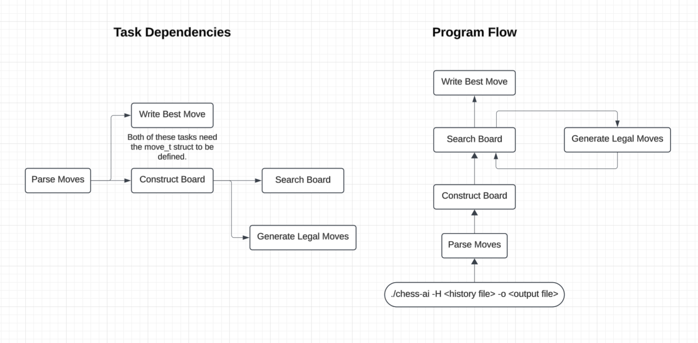

The program flow is a summary of how the engine works.  

The tasks dependencies represent the order in which tasks should be implemented. For example, we cannot construct the board until we have a struct for moves depend. This is because the board should have a method that takes a move and makes that move.  

Here we put the tasks we have done:
